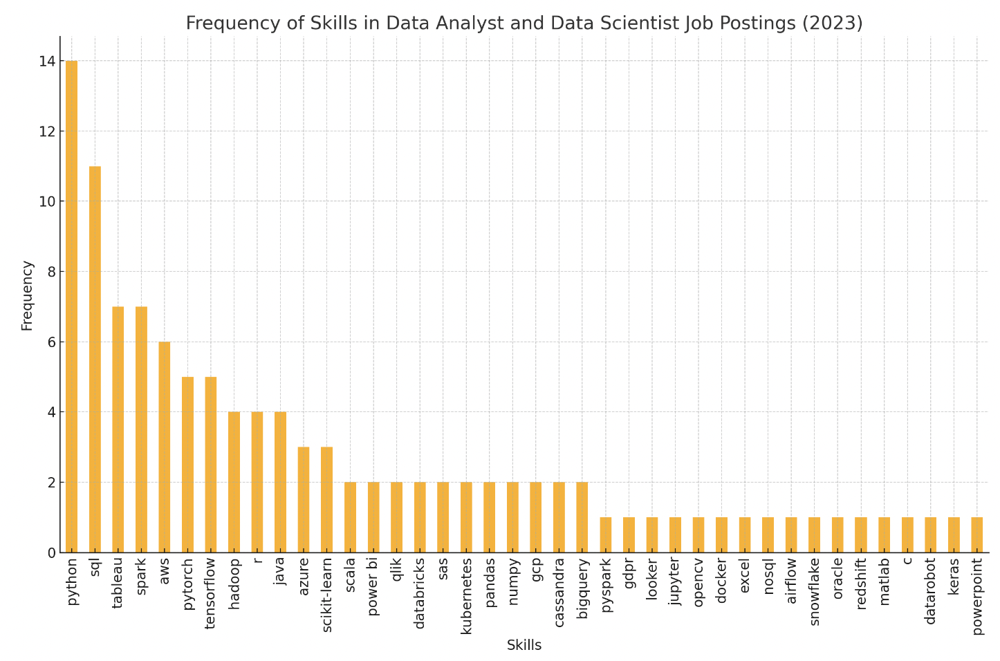

# Introduction
As an aspiring data analyst, I was curious about the current state of the data job market. 👩🏻‍💻 Luckily, the SQL project I undertook through Luke Barousse's Data Analytics course provided me with the tools to gain insights about just that. 📊 I analyzed remote data analyst and data scientist roles, focusing on top-paying jobs and the most in-demand skills. Leveraging data from 2023 job postings, I identified the high-paying and optimal skills required in the industry. Let's dive in! 🤓

Check out my SQL queries here: [project_sql folder](/project_sql/)

# Background
As part of Luke Barousse's SQL for Data Analytics course, I completed a SQL project analyzing the data job market. Utilizing course data, I explored insights on job titles, salaries, locations, and skills for data analyst and data scientist roles, providing a detailed overview of the industry's current demands and trends.

These are the questions I wanted to answer:
1. What are the top-paying data analyst and data scientist jobs that are available remotely?
2. What skills are required for the top-paying data analyst and data scientist jobs?
3. What are the most in-demand skills for data analysts and data scientists?
4. What are the top skills associated with higher salaries?
5. What are the most optimal skills to learn (high demand and high-paying)?

I focused on remote data analyst and data scientist roles so that I could see similarities and differences between the two.

# Tools I Used
For this project, I used these key tools:
- **SQL:** This allowed me to query the database and retrieve the essential data I needed to gain insights.
- **PostgreSQL:** This was the most ideal database management system for me to use.
- **Visual Studio Code:** This made executing SQL queries more convenient and efficient.
- **Git & Github:** These allowed me to share my SQL scripts and analysis, and made sure versions were kept up to date.

# The Analysis
Each of the queries for this project aimed, step-by-step, to analyze specific information about the data job market. Here's how I approached each question:

### 1. Top Paying Data Analyst and Data Scientist Jobs
To identify the top-paying roles, I filtered the data analyst and data scientist jobs by average yearly salary. I also focused on remote jobs by filtering for work-from-home availability. I limited the results to 25 in descending order by average salary. This query highlights the top 25 highest paying opportunities in data analysis and data science.
```sql
SELECT
    job_title_short,
    job_title,
    job_location,
    job_schedule_type,
    salary_year_avg,
    company_dim.name AS company_name
FROM
    job_postings_fact
LEFT JOIN company_dim
    ON job_postings_fact.company_id = company_dim.company_id
WHERE
    (job_title_short = 'Data Analyst'
    OR job_title_short = 'Data Scientist')
    AND salary_year_avg IS NOT NULL
    AND job_work_from_home = TRUE
ORDER BY
    salary_year_avg DESC
LIMIT 25;
```
Here are some insights about this data:
1. **High Salaries for Specialized and Leadership Roles:**
The highest paying roles include specialized and leadership positions such as "Head of Data Science," "Director of Analytics," and "Chief Data Officer." This trend indicates that advanced expertise and managerial responsibilities significantly boost earning potential in the data field.

2. **Dominance of Data Scientist Roles:**
Most of the top-paying positions are for data scientists rather than data analysts. This suggests a higher demand and greater compensation for data scientists, reflecting their crucial role in advanced data analysis, machine learning, and strategic decision-making.

3. **Remote Work Opportunities:**
All listed positions are available remotely, highlighting a strong trend toward remote work in the data industry. This trend emphasizes the flexibility and growing acceptance of remote work arrangements, allowing companies to attract top talent regardless of geographic location.

*ChatGPT generated these insights based on my SQL query results*

### 2. Skills Required for Top Paying Data Analyst and Data Scientist Jobs
Based on the results of my query from the first step, I learned that there were more high-paying data scientist roles than data analyst roles. With this, I wanted to discover what skills were required of these roles. I used the first query to create a temporary table, then joined this table with the skills data in order to retrieve the skills required.
```sql
WITH top_paying_jobs AS (
    SELECT
        job_id,
        job_title_short,
        job_title,
        salary_year_avg,
        company_dim.name AS company_name
    FROM
        job_postings_fact
    LEFT JOIN company_dim
        ON job_postings_fact.company_id = company_dim.company_id
    WHERE
        (job_title_short = 'Data Analyst'
        OR job_title_short = 'Data Scientist')
        AND salary_year_avg IS NOT NULL
        AND job_work_from_home = TRUE
    ORDER BY
        salary_year_avg DESC
    LIMIT 25
)

SELECT
    top_paying_jobs.*,
    skills_dim.skills
FROM top_paying_jobs
INNER JOIN skills_job_dim
    ON top_paying_jobs.job_id = skills_job_dim.job_id
INNER JOIN skills_dim
    ON skills_job_dim.skill_id = skills_dim.skill_id
ORDER BY
    salary_year_avg DESC
```
Here's an overview of the frequency of each skill mentioned in the job postings:
| Skill          | Demand Count |
|----------------|--------------|
| Python         | 14           |
| SQL            | 11           |
| Tableau        | 7            |
| Spark          | 7            |
| AWS            | 6            |
| PyTorch        | 5            |
| TensorFlow     | 5            |
| Hadoop         | 4            |
| R              | 4            |
| Java           | 4            |
| Azure          | 3            |
| Scikit-learn   | 3            |



*Bar graph visualizing the frequency of skills mentioned; ChatGPT generated these insights and graph from my SQL query results*

### 3. Top 5 In-Demand Skills for Data Analysts and Data Scientists
The previous query taught me about the skills required for top-paying roles. Now, I wanted to know more about the top 5 in-demand skills for data analysts and data scientists, separately. To achieve this, I used the COUNT function to calculate the demand for each skill, and ordered the results by the demand count in descending order to get the top 5 most in-demand skills. I did this for both data analyst and data scientist so I could compare the results.
```sql
SELECT
    skills,
    COUNT(skills_job_dim.job_id) AS demand_count
FROM job_postings_fact
INNER JOIN skills_job_dim
    ON job_postings_fact.job_id = skills_job_dim.job_id
INNER JOIN skills_dim
    ON skills_job_dim.skill_id = skills_dim.skill_id
WHERE
    job_title_short = 'Data Analyst'
GROUP BY
    skills
ORDER BY
    demand_count DESC
LIMIT 5;


SELECT
    skills,
    COUNT(skills_job_dim.job_id) AS demand_count
FROM job_postings_fact
INNER JOIN skills_job_dim
    ON job_postings_fact.job_id = skills_job_dim.job_id
INNER JOIN skills_dim
    ON skills_job_dim.skill_id = skills_dim.skill_id
WHERE
    job_title_short = 'Data Scientist'
GROUP BY
    skills
ORDER BY
    demand_count DESC
LIMIT 5;
```

The results showed that these were the top 5 in-demand skills:

**Data Analyst**
| Skill    | Demand Count  |
|----------|---------|
| SQL      | 92628   |
| Excel    | 67031   |
| Python   | 57326   |
| Tableau  | 46554   |
| Power BI | 39468   |


**Data Scientist**
| Skill   | Demand Count |
|---------|--------------|
| Python  | 114016       |
| SQL     | 79174        |
| R       | 59754        |
| SAS     | 29642        |
| Tableau | 29513        |


Both data analyst and data scientist roles call for SQL, Python, and Tableau skills. They differ in terms of which skills are more highly demanded. While Python comes first on the list for data scientist roles, it comes third for data analyst roles.

### 4. Top Paying Skills
I've learned about the top paying jobs and skills associated with these jobs, as well as the most in-demand skills. Now I wanted to know about the top paying skills. In order to get this data, I filtered the skills of data analyst roles by average salary and ordered it in descending order. I limited it to 25 to see the top 25 highest paying skills. I repeated the query for data scientist roles.

```sql
SELECT
    skills,
    ROUND(AVG(salary_year_avg), 2) AS avg_salary
FROM job_postings_fact
INNER JOIN skills_job_dim
    ON job_postings_fact.job_id = skills_job_dim.job_id
INNER JOIN skills_dim
    ON skills_job_dim.skill_id = skills_dim.skill_id
WHERE
    job_title_short = 'Data Analyst' AND
    salary_year_avg IS NOT NULL
GROUP BY
    skills
ORDER BY
    avg_salary DESC
LIMIT 25


SELECT
    skills,
    ROUND(AVG(salary_year_avg), 2) AS avg_salary
FROM job_postings_fact
INNER JOIN skills_job_dim
    ON job_postings_fact.job_id = skills_job_dim.job_id
INNER JOIN skills_dim
    ON skills_job_dim.skill_id = skills_dim.skill_id
WHERE
    job_title_short = 'Data Scientist' AND
    salary_year_avg IS NOT NULL
GROUP BY
    skills
ORDER BY
    avg_salary DESC
LIMIT 25
```

Based on the top 25 high-paying skills for data analysts, here are three quick insights into the trends:

1. **Emergence of Specialized Tools and Frameworks:**
Tools like SVN (Subversion), DataRobot, and VMware are among the top-paying skills, indicating a high demand for expertise in specific platforms and frameworks. This trend suggests that data analysts with specialized tool knowledge can command higher salaries.

2. **Programming Languages and Libraries:**
High-paying skills also include programming languages and libraries such as Solidity, Golang, Keras, PyTorch, and TensorFlow. This highlights the importance of having strong programming skills and familiarity with machine learning frameworks in the data analyst role.

3. **Infrastructure and DevOps Skills:**
Skills related to infrastructure and DevOps, such as Terraform, Puppet, Ansible, and Kafka, are also among the high-paying skills. This indicates a growing need for data analysts to have knowledge in managing and deploying data infrastructure, reflecting the integration of data analysis with cloud and automation technologies.

Based on the top 25 high-paying skills for data scientists, here are three quick insights into the trends:

1. **Project Management and Collaboration Tools:**
Skills like Asana, Airtable, Slack, Notion, and Zoom are among the high-paying skills, indicating a significant emphasis on project management and collaboration tools. This trend suggests that data scientists who can effectively manage projects and collaborate with teams are highly valued.

2. **Specialized Programming Languages and Libraries:**
High-paying skills include specialized programming languages and libraries such as Elixir, Lua, Solidity, Ruby on Rails, Objective-C, and Haskell. This highlights the importance of diverse and specialized programming skills in the data scientist role, particularly in languages that support specific applications or industries.

3. **Machine Learning and Data Infrastructure:**
Skills related to machine learning frameworks and data infrastructure, such as Watson, Hugging Face, Airflow, Neo4j, DynamoDB, and BigQuery, are also among the high-paying skills. This indicates a high demand for data scientists who are proficient in advanced machine learning technologies and capable of managing complex data systems and pipelines.

*ChatGPT generated these insights based on my SQL query results*

### 5. Optimal Skills
Finally, I wanted to identify the most in-demand AND high-paying skills for data analyst and data scientist roles. To do this, I joined all the tables and selected the skill ID, skills, demand count (using COUNT function), and average salary. I ordered the results first by average salary then by demand count, as I wanted to see the jobs with higher salaries more than high demand. Additionally, I filtered the demand count using the HAVING clause to make sure the results still showed jobs high in demand.

```sql
SELECT
    skills_dim.skill_id,
    skills_dim.skills,
    COUNT(skills_job_dim.job_id) AS demand_count,
    ROUND(AVG(salary_year_avg), 2) AS avg_salary
FROM
    job_postings_fact
INNER JOIN skills_job_dim
    ON job_postings_fact.job_id = skills_job_dim.job_id
INNER JOIN skills_dim
    ON skills_job_dim.skill_id = skills_dim.skill_id
WHERE
    job_title_short = 'Data Analyst'
    AND salary_year_avg IS NOT NULL
    AND job_work_from_home = TRUE
GROUP BY
    skills_dim.skill_id
HAVING
    COUNT(skills_job_dim.job_id) > 10
ORDER BY
    avg_salary DESC,
    demand_count DESC
LIMIT 25


SELECT
    skills_dim.skill_id,
    skills_dim.skills,
    COUNT(skills_job_dim.job_id) AS demand_count,
    ROUND(AVG(salary_year_avg), 2) AS avg_salary
FROM
    job_postings_fact
INNER JOIN skills_job_dim
    ON job_postings_fact.job_id = skills_job_dim.job_id
INNER JOIN skills_dim
    ON skills_job_dim.skill_id = skills_dim.skill_id
WHERE
    job_title_short = 'Data Scientist'
    AND salary_year_avg IS NOT NULL
    AND job_work_from_home = TRUE
GROUP BY
    skills_dim.skill_id
HAVING
    COUNT(skills_job_dim.job_id) > 10
ORDER BY
    avg_salary DESC,
    demand_count DESC
LIMIT 25
```

Here are some insights into the data:

1. **Cloud and Big Data Technologies:**
Both data analysts and data scientists highly value skills related to cloud platforms and big data technologies. Skills like AWS, Snowflake, and BigQuery appear in both lists, indicating a strong market demand for professionals proficient in these areas.

2. **Programming and Data Manipulation:**
Python is a highly demanded skill for both data analysts and data scientists, highlighting the importance of programming and data manipulation in both roles. Other programming-related skills like Java and SQL also appear in both lists, reinforcing the need for coding proficiency.

3. **Data Visualization and Analytics Tools:**
Tools such as Tableau and Looker are present in both lists, suggesting that data visualization and analytics skills are critical for both data analysts and data scientists. These tools are essential for translating complex data insights into understandable formats.

In summary, there is a significant overlap in the demand for cloud computing, big data technologies, programming skills, and data visualization tools for both data analysts and data scientists. This reflects a convergence in the skill sets required for these roles, driven by the evolving demands of the data industry.

*ChatGPT generated these insights based on my SQL query results*


# What I Learned
Throughout this project, I've added some valuable skills to my SQL toolkit:
- 📉 **Joining Tables:** I've mastered the art of joining tables in order to merge important info and gain useful insights from data stored across different tables.
- ✏️ **Complex Queries:** I've learned to build some pretty complex queries filled with aggregation functions, filters, temporary tables, and more. Taking things step-by-step helped make me less intimidated by complex queries and more fascinated by their ability to retrieve exactly what I need.
- 🔎 **Analytical Thinking:** I've practiced my analytical thinking with every set of results retrieved from my queries. Did the results answer my question? What more is the data telling me? What limitations does the data have? Tons of questions would pop in my head when looking at the data. Using ChatGPT as a useful tool for quick insights also helped my analysis.


# Conclusions
Here are five quick insights summarizing the data gathered from my queries:

1. **High-Paying Skills:** Skills like Asana, Airtable, and Redhat stand out as top-paying skills for data scientists, with salaries significantly exceeding $180,000. This indicates that expertise in specific software and platforms can lead to lucrative opportunities in the data science field.

2. **In-Demand Skills for Data Scientists:** Skills such as Python, AWS, and SQL dominate in terms of demand, with Python leading by a wide margin. This highlights the importance of mastering these core skills to enhance employability in the data science job market.

3. **Remote Data Science Jobs:** The highest-paying remote data science roles often come with titles like "Staff Data Scientist" and "Director of Data Science." These roles frequently offer salaries above $300,000, suggesting that senior and specialized positions are particularly well-compensated.

4. **Trends in Data Analyst Skills:** For data analysts, skills like Go, Confluence, and Hadoop are associated with high average salaries. Additionally, cloud-based tools like Snowflake and BigQuery are also highly valued, reflecting a trend towards cloud computing in data analysis.

5. **Common High-Paying Skills Across Roles:** There is overlap in high-paying skills between data analysts and data scientists, with skills like Go, BigQuery, and Snowflake appearing in both lists. This indicates that certain technical skills are universally valuable across different data-focused roles.

These insights provide a comprehensive overview of the key skills and trends in the data science and data analyst job markets, emphasizing the importance of both technical expertise and specialization.

*ChatGPT generated these insights based on my SQL query results*

### Closing Thoughts
I worked on this project because as an aspiring data analyst, I needed to practice and improve on my SQL skills. Not only was I able to accomplish that, I was also able to take away some learnings about the data job market that I myself am about to enter. I wanted to find out if data scientist roles were possible for me to undertake, and if they were comparable to data analyst roles at all. I learned that while the two share similarities, data scientist roles actually offer higher salaries! This could be something to consider on my data journey, but for now, I think I'll stick to data analysis. 🤓 After everything, I'm happy to have learned that SQL isn't just a valuable tool that I'll use when I land a job, but also something that I can harness the power of currently in my job search.